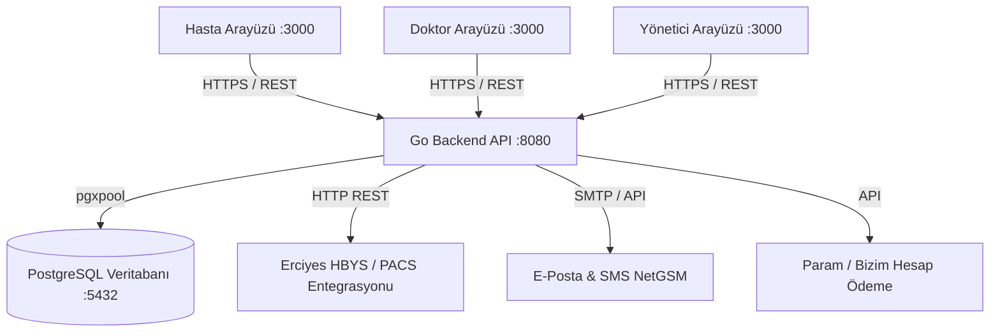
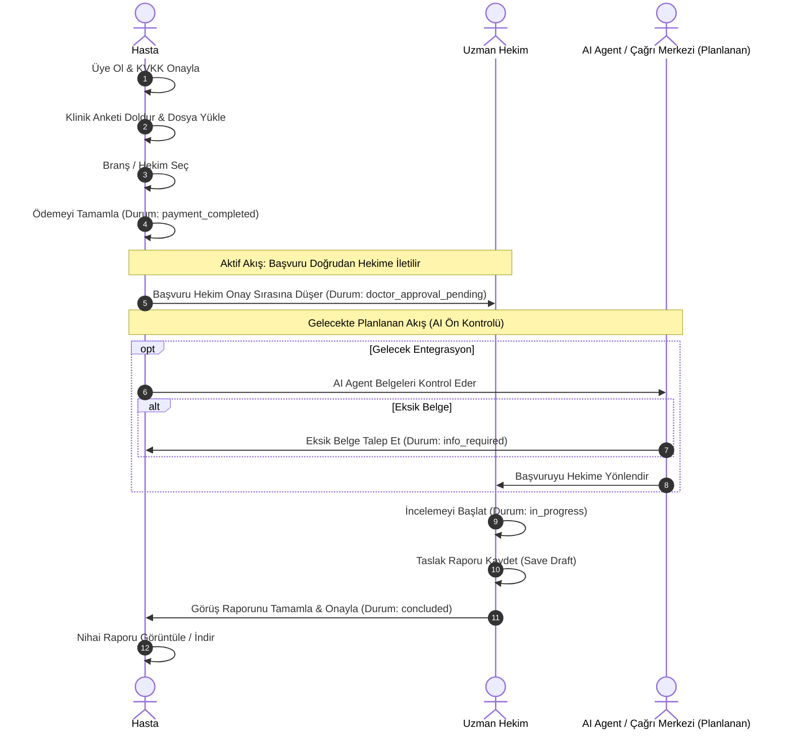
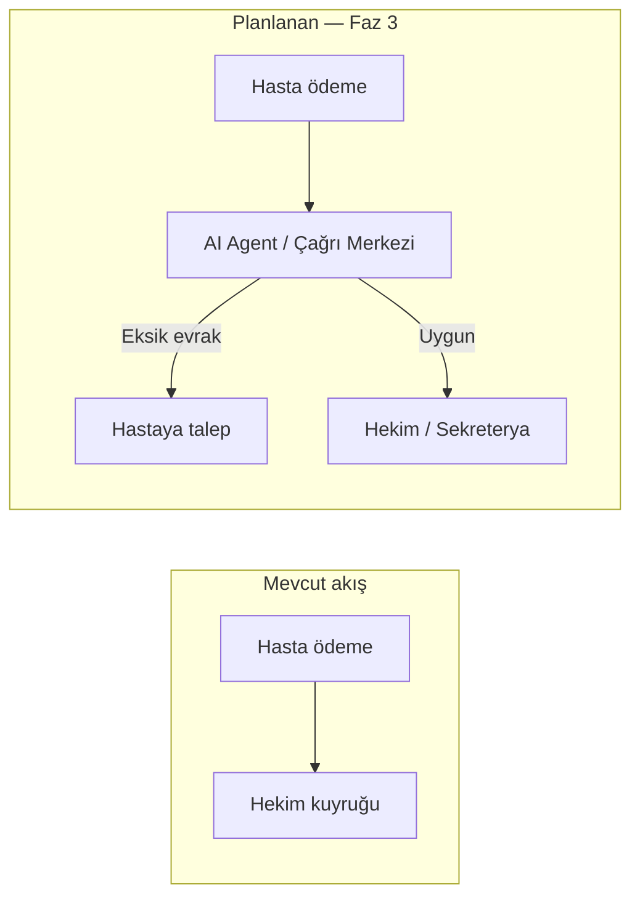

# Tıbbi Danışmanlık ve İkinci Görüş Platformu — Proje Dokümantasyonu

Bu doküman, Erciyes Üniversitesi Tıp Fakültesi için geliştirilen **Tıbbi Danışmanlık ve İkinci Görüş Platformu**'nun (Medical Consultation Platform) tüm mimarisini, veritabanı şemasını, iş akışlarını, API uç noktalarını ve kurulum/çalıştırma yönergelerini içermektedir.

---

## 1. Projeye Genel Bakış

Platformun temel amacı, hastaların veya onların yakınlarının hastaneye fiziksel olarak gitmelerine gerek kalmadan, uzman hekimlerden tıbbi tahliller, epikriz raporları ve radyolojik görüntüler (PACS) doğrultusunda ikinci bir görüş (tıbbi danışmanlık) raporu alabilmelerini sağlamaktır.

### Temel Özellikler:
- **Çoklu Rol Yönetimi**: Hasta, Doktor, Hemşire/Tıbbi Sekreter ve Yönetici (Admin) rollerine özel paneller. *(Not: Mevcut iş akışında hemşire/sekreter katmanı devre dışı bırakılmıştır, başvurular doğrudan doktora gitmektedir. Bu katmanın ilerleyen aşamalarda bir AI Agent veya Çağrı Merkezi sistemi ile yönetilmesi planlanmaktadır.)*
- **Kapsamlı Klinik Başvuru Akışı**: Dinamik anket soruları, epikriz/tahlil/dosya yükleme ve hekim seçimi.
- **Tümleşik Ödeme Sistemleri**: Param (ödeme) ve Bizim Hesap (fatura) entegrasyon altyapısı — geliştirmede test/mock, canlıda Faz 2’de devreye alınacak (bkz. §9).
- **Erciyes HBYS Entegrasyonu**: Yatan hastaların başvuru yapmasının engellenmesi ve PACS görüntüleme bağlantılarının sorgulanması.
- **Güvenli Raporlama ve Taslak Kaydetme**: Hekimler için taslak rapor kaydetme ve tamamlandığında hastaya iletilen nihai tıbbi görüş raporları.
- **Tam Denetim ve İzlenebilirlik**: Sistem üzerindeki kritik yönetici işlemlerinin ve durum değişikliklerinin loglanması (Audit & Status History).

---

## 2. Mimari ve Teknoloji Yığını

Proje, bağımsız bir Go backend servisi ve birleşik bir Next.js frontend uygulamasından oluşmaktadır.



### Backend (Go - Golang)
- **Framework/Router**: [go-chi/v5](https://github.com/go-chi/chi) (Hafif ve performanslı HTTP router).
- **Veritabanı Sürücüsü**: [jackc/pgx/v5](https://github.com/jackc/pgx) (Bağlantı havuzu desteği sunan yerel PostgreSQL sürücüsü).
- **Kimlik Doğrulama**: JWT (JSON Web Token) - Access ve Refresh Token mekanizması.
- **Güvenlik**: Hız sınırlama (Rate limiting), CORS ayarları, güvenli HTTP başlıkları (Security Headers), gövde boyutu sınırlaması (Max Body Size).
- **Yazılım Mimarisi**: Katmanlı mimari (`cmd` -> `handler` -> `service` -> `repository` / `domain`).

### Frontend (Next.js - TypeScript)
- **Dizin**: `frontend/web` (Eski `portal`, `doctor`, `admin` uygulamaları bu dizinde tek bir Next.js projesinde birleştirilmiştir).
- **Tasarım Altyapısı**: TailwindCSS ve Radix UI tabanlı bileşenler (Shadcn esintili).
- **Sayfa Rotaları (App Router)**:
  - `/` : Ana giriş hub'ı (Hasta, Hekim ve Yönetici geçiş kartları).
  - `/patient` : Hasta portalı (Başvurular, yeni başvuru oluşturma, profil güncelleme).
  - `/doctor` : Doktor ve Hemşire portalı (İş listeleri, inceleme ve raporlama ekranları).
  - `/admin` : Yönetim paneli (Kullanıcı, doktor, ödeme, hastane ve log yönetimi).
  - `/verify` : Kamuoyuna açık tıbbi rapor doğrulama sayfası.

---

## 3. Veritabanı Şeması ve Durum Kodları

Veritabanı ilişkileri ve veri modelleri PostgreSQL üzerinde yapılandırılmıştır.

### Temel Tablolar:
1. `hospitals`: Entegre çalışan hastaneler ve ayarları.
2. `users`: Sistemdeki tüm kullanıcıların ortak tablosu (Hasta, Doktor, Tıbbi Sekreter, Admin).
3. `professions`: Tıbbi uzmanlık branşları (Örn: Kardiyoloji, Dahiliye).
4. `care_providers`: Doktorların unvan, branş, hastane ve danışmanlık ücreti (fee) bilgileri.
5. `care_provider_professions`: Doktorlar ile branşlar arasındaki çoklu (many-to-many) ilişki tablosu.
6. `agreements`: Kayıt olurken onaylanan KVKK ve Kullanıcı Sözleşmeleri sürüm takibi.
7. `verification_tokens`: OTP (Tek kullanımlık şifre) kayıtları (SMS/E-posta doğrulama için).
8. `applications`: Tıbbi ikinci görüş başvurularının ana kayıt tablosu.
9. `application_represented_persons`: Hasta kendi yakını adına başvuru yaptıysa, ilgili yakınının bilgileri.
10. `application_surveys`: Başvuru anında doldurulan klinik anket verileri (JSON formatında).
11. `application_temporal_reports`: Doktorlar tarafından yazılan taslak raporların geçmişi.
12. `application_final_reports`: Tamamlanan nihai tıbbi görüş raporları.
13. `application_attachments`: Hastaların yüklediği tıbbi belgeler, tahliller ve epikriz dosyaları.
14. `application_status_history`: Başvurunun geçirdiği tüm durum değişikliklerinin aktör bilgisiyle birlikte loglandığı tablo.
15. `application_notes`: Sağlık personelleri ve doktorlar arasındaki iç yazışma notları.
16. `payments`: Param, Bizim Hesap veya Ücretsiz ödeme kanallarından alınan ödeme detayları.
17. `audit_logs`: Yöneticilerin yaptığı kritik işlemleri kaydeden denetim tablosu.

### Başvuru Durum Kodları (Application Status Codes):
Başvurular yaşam döngüleri boyunca aşağıdaki durum kodlarını alırlar:

| Kod | Durum Adı | Açıklama |
| :---: | :--- | :--- |
| **0** | `payment_pending` | Ödeme Bekleniyor (Başvuru oluşturuldu ancak ödeme henüz yapılmadı) |
| **1** | `payment_completed`| Ödeme Tamamlandı (Hekim/Sekreter inceleme sırasına girdi) |
| **2** | `approved` | Ön Onay Verildi (Evraklar uygun, inceleme başlayabilir) |
| **3** | `rejected` | Reddedildi (Hekim tarafından gerekçesiyle iptal edildi) |
| **4** | `in_progress` | İncelemede (Hekim rapor taslağı yazmaya başladı) |
| **5** | `info_required` | Ek Bilgi/Belge Talep Edildi (Hastanın eksik dosya yüklemesi gerekiyor) |
| **6** | `concluded` | Rapor Tamamlandı (Nihai tıbbi görüş raporu hastaya açıldı) |
| **7** | `cancelled` | İptal Edildi (İşlem başlamadan iptal edilen başvurular) |
| **8** | `refund_pending` | İade Bekleniyor (Ödemenin iade edilmesi için onay sürecinde) |
| **9** | `refunded` | İade Edildi (Ödeme tutarı hastaya geri gönderildi) |
| **10**| `doctor_approval_pending` | Hekim Onayı Bekleniyor (Hemşire incelemesi bitti, hekime yönlendirildi) |
| **11**| `medical_secretary` | Tıbbi Sekreter Kuyruğunda (Evrak ve form ön incelemesinde) |

---

## 4. İş Akışları (Workflows)

Mevcut aktif sistemde hastaların başvuruları ödeme sonrasında doğrudan hekime iletilir (arada insan gücü gerektiren bir tıbbi sekreter/hemşire katmanı bulunmamaktadır). Ancak sistem altyapısı bu katmanı desteklemekte olup ileride **AI Agent** veya **Çağrı Merkezi** entegrasyonu ile bu ön inceleme adımının otomatikleştirilmesi planlanmaktadır.



---

## 5. API Rotaları (Endpoints)

Tüm API'ler `/api/v1` ön eki altındadır.

### 🔐 Kimlik Doğrulama (`/auth`)
- `POST /auth/login` : Kullanıcı girişi.
- `GET /auth/agreements` : Kayıt esnasında gösterilecek aktif sözleşmeler.
- `POST /auth/register/initiate` : Kayıt işlemini başlatır (SMS/E-posta doğrulama kodu gönderir).
- `POST /auth/register/complete` : Doğrulama kodunu kontrol eder ve kaydı tamamlar.
- `POST /auth/password/forgot/initiate` : Şifre sıfırlama sürecini başlatır.
- `POST /auth/password/forgot/complete` : Şifreyi sıfırlar.
- `POST /auth/refresh` : JWT Access token yeniler.
- `POST /auth/tfa/verify` : İki adımlı doğrulamayı kontrol eder.

### 📝 Başvurular (`/applications`) [JWT Yetkilendirmeli]
- `POST /applications` : Yeni başvuru başlatır (klinik form ve yakını bilgisiyle).
- `POST /applications/mine` : Hastanın kendi başvurularını sayfalandırılmış listeler.
- `POST /applications/queue/nurse` : Hemşire kuyruğu başvurularını listeler.
- `POST /applications/queue/doctor` : Hekim kuyruğu başvurularını listeler.
- `GET /applications/{id}` : Başvuru detaylarını döner.
- `GET /applications/{id}/preview` : Başvuru önizleme verilerini getirir.
- `PATCH /applications/{id}` : Başvuru güncelleme (durum veya detay).
- `DELETE /applications/{id}` : Başvuru silme (taslak halindeyse).
- `POST /applications/{id}/payment` : Ödeme durumu güncelleme.
- `GET /applications/{id}/report` : Nihai raporu getirir.
- `POST /applications/{id}/report/viewed` : Raporun görüntülendiğini işaretler (`report_viewed_at` güncellenir).
- `GET/POST/DELETE /applications/{id}/attachments` : Dosya eklerini listeleme, yükleme ve silme işlemleri.
- `POST/GET /applications/{id}/notes` : Tıbbi personeller arası not ekleme ve geçmişi.
- `POST /applications/{id}/assess` : Hemşire ön değerlendirme notu.
- `POST /applications/{id}/send-to-doctor` : Hemşirenin başvuruyu hekime yönlendirmesi.
- `PUT/GET /applications/{id}/report/draft` : Hekim taslak rapor kaydetme ve getirme.
- `POST /applications/{id}/conclude` : Hekimin nihai raporu tamamlayıp başvuruyu sonuçlandırması.

### 🏥 Hastaneler & Branşlar
- `GET /professions` : Aktif branşları listeler.
- `GET /care-providers` : Doktor listesini döner.

### 🌐 Kamu Doğrulama
- `GET /public/applications/{id}/verify` : İmzalı raporların doğruluğunu sorgulama.

### 🛠️ Yönetici Paneli (`/admin`) [Admin/Developer Yetkili]
- `GET /admin/applications` : Sistemdeki tüm başvurular.
- `PUT /admin/applications/{id}` : Başvuru güncelleme.
- `POST /admin/applications/{id}/assign-doctor` : Başvuruya hekim atama.
- `POST /admin/applications/{id}/cancel` : Başvuruyu iptal etme.
- `GET/POST /admin/hospitals` : Hastane yönetimi.
- `GET/POST /admin/doctors` : Hekim tanımlama.
- `GET /admin/payments` : Ödeme işlemleri listesi ve filtreleme.
- `GET /admin/payments/export` : CSV formatında ödemeleri dışa aktarma.
- `POST /admin/refunds` : Ödeme iade emri oluşturma.
- `GET /admin/notifications` : Gönderilen SMS ve E-posta bildirim logları.
- `GET/PUT/PATCH /admin/users` : Kullanıcı detayları güncelleme ve aktiflik kontrolü.
- `GET /admin/audit-logs` : Sistem hareket günlüğü (Audit Logs).

---

## 6. Entegrasyonlar ve Dış Sistemler

### Erciyes HBYS (Hastane Bilgi Yönetim Sistemi) Entegrasyonu
- **PACS Linki**: Erciyes radyoloji veritabanına bağlanarak hastanın taranmış radyolojik görüntülerini inceleme ekranında hekime doğrudan sunar.

### Ödeme Entegrasyonu

| Bileşen | Şimdiki durum (MVP) | Canlıya geçişte gerekli |
| :--- | :--- | :--- |
| **Param** | Test/sandbox modu; test kartları ile ödeme simülasyonu | Canlı merchant bilgileri, 3D Secure, hata/iptal senaryoları, PCI uyumu |
| **Bizim Hesap** | Ödeme sonrası otomatik fatura oluşturma altyapısı hazır; test modu | Canlı API anahtarı, firma tanımı, fatura şablonları ve muhasebe mutabakatı |

Ödeme akışı uygulama tarafında **yalnızca Param** üzerinden yapılır; fatura **Bizim Hesap** ile otomatik kesilir. Canlı ortamda uçtan uca test (başarılı ödeme, red, iade) zorunludur.

### Bildirim Servisi (Notification Service)

| Kanal | Şimdiki durum (MVP) | Canlıya geçişte gerekli |
| :--- | :--- | :--- |
| **SMS (NetGSM)** | `SMS_PROVIDER=mock` — konsola log; altyapı ve şablon anahtarları kodda mevcut | NetGSM kullanıcı/şifre/başlık, OTP ve durum SMS’leri, gönderim logları ve hata yönetimi |
| **E-posta (SMTP)** | `EMAIL_PROVIDER=mock` — konsola log | SMTP veya transactional e-posta sağlayıcısı (SendGrid, AWS SES vb.), HTML şablonlar, bounce/spam takibi |

Bildirim tetikleyicileri (kayıt OTP, şifre sıfırlama, ödeme onayı, rapor hazır) backend’de tanımlıdır; canlı sağlayıcı kimlik bilgileri `.env` ile devreye alınır.

---

## 9. Entegrasyon Yol Haritası (Roadmap)

Aşağıdaki maddeler **şu an tamamlanmış ürün kapsamında değildir**; sırayla planlanması gereken dış bağımlılıklardır.

### Faz 2 — Canlı entegrasyonlar (öncelikli, orta vadeli)

Platformun production ortamında çalışması için gerekli:

1. **SMS entegrasyonu (NetGSM)**
   - Kayıt ve şifre sıfırlama OTP
   - Başvuru durum değişiklikleri (rapor hazır vb.)
   - Admin bildirim takibi ekranı ile uyumlu loglama

2. **E-posta entegrasyonu**
   - Hoş geldiniz, ödeme onayı, rapor hazır e-postaları
   - HTML şablonlar ve KVKK uyumlu içerik

3. **Ödeme entegrasyonu (Param — canlı)**
   - Sandbox’tan production’a geçiş
   - 3D Secure, webhook/callback doğrulama (varsa), iade akışı ile uyum

4. **Fatura entegrasyonu (Bizim Hesap — canlı)**
   - Başarılı ödeme sonrası otomatik e-fatura / e-arşiv
   - Admin ödemeler ekranından fatura görüntüleme

**Not:** Geliştirme ortamında bu servisler mock/test modunda çalışır; `.env.example` dosyasındaki ilgili değişkenler referans alınmalıdır.

### Faz 3 — AI Agent / Çağrı Merkezi katmanı (ileri vadeli, ayrı proje)

Hasta ödemeyi tamamladıktan sonra başvurunun **doğrudan hekime düşmesi** yerine (veya sekreterya kuyruğunun yanında) araya konulması planlanan **büyük ve bağımsız** bir bileşendir. **Şu an geliştirilmemektedir.**

Planlanan rol:

- Başvuru evraklarının ön kontrolü (eksik belge, okunaksız PDF vb.)
- Hastaya otomatik bilgi talebi (`info_required` durumu)
- Sesli/görüşmeli çağrı merkezi veya sohbet tabanlı AI agent ile yönlendirme
- Uygun başvuruların hekime veya sekreterya kuyruğuna iletilmesi



Bu faz için ayrıca gerekecekler (yüksek seviye):

- Agent/IVR veya chatbot platformu seçimi ve API entegrasyonu
- Evrak sınıflandırma / OCR (isteğe bağlı)
- İnsan operatör devralma (handoff) senaryoları
- KVKK, kayıt altına alma ve tıbbi veri güvenliği değerlendirmesi
- Mevcut `application_status_history` ve bildirim altyapısı ile entegrasyon

**Özet:** SMS, e-posta ve canlı ödeme **Faz 2** işidir; AI Agent / çağrı merkezi **Faz 3** ayrı bir proje olarak ele alınmalıdır.

---

## 7. Yerel Kurulum ve Çalıştırma Rehberi

Sistemi lokal ortamınızda çalıştırmak için aşağıdaki adımları sırasıyla uygulayınız.

> [!WARNING]
> Proje kök dizininde doğrudan bir `package.json` dosyası bulunmamaktadır. Bu nedenle doğrudan `/Users/canozgan/Documents/sagl-k` dizini altında `npm run dev` komutunu çalıştırmak `ENOENT` hatasına yol açar. Backend ve Frontend uygulamalarını kendi alt dizinlerine giderek başlatmalısınız.

### Adım 1: Çevre Değişkenlerini Hazırlama
Kök dizindeki `.env.example` dosyasını `.env` adıyla kopyalayın:
```bash
cp .env.example .env
```
Gerekli veritabanı, JWT ve entegrasyon bilgilerini bu dosya içinden güncelleyin.

### Adım 2: Veritabanını Başlatma (Docker)
PostgreSQL veritabanını Docker Compose kullanarak arka planda başlatın:
```bash
docker compose up -d postgres
```
Bu komut veritabanını başlatacak ve `backend/migrations` klasöründeki tüm SQL şemalarını otomatik olarak veritabanına uygulayacaktır.

### Adım 3: Backend Servisini Çalıştırma
`backend` dizinine geçin ve Go uygulamasını başlatın:
```bash
cd backend
go run ./cmd/api
```
Backend servisi varsayılan olarak **`http://localhost:8080`** portunda çalışmaya başlayacaktır.

### Adım 4: Frontend Uygulamasını Çalıştırma
Yeni bir terminal açıp `frontend/web` dizinine gidin, bağımlılıkları yükleyin ve geliştirme sunucusunu başlatın:
```bash
cd frontend/web
pnpm install  # veya yarn install / npm install
pnpm dev      # veya yarn dev / npm run dev
```
Frontend uygulaması **`http://localhost:3000`** portunda yayına girecektir. Tarayıcınızdan bu adrese giderek sisteme erişebilirsiniz.

---

## 8. Hazır Test Hesapları

Geliştirme, staging ve test süreçlerinde kullanabileceğiniz önceden tanımlanmış kullanıcı hesapları aşağıdadır:

- **Yönetici (Admin)**:
  - T.C. Kimlik No: `10000000146`
  - Şifre: `Admin123!`
- **Uzman Hekim (Doctor)**:
  - T.C. Kimlik No: `20000000114`
  - Şifre: `Doctor123!`
- **Hasta (Patient)**:
  - Kayıt olmak için arayüzdeki `/patient/register` (Kayıt Ol) sayfasını kullanabilir veya mevcut bir hasta TC'si ile giriş yapabilirsiniz.

### Staging ortamına seed

Stage DB'ye aynı demo kullanıcıları eklemek için (`.env.stage` içindeki `DATABASE_URL` kullanılır):

```bash
cd backend
go run ./cmd/migrate   # tablolar yoksa önce migration
go run ./cmd/seed      # admin + doktor demo hesapları
```

Staging giriş adresleri:
- Frontend: `https://stage-erciyes.tibbidanismanlik.com`
- API: `https://apistage.tibbidanismanlik.com`

---

## 10. İlgili dokümanlar

- **Entegrasyon yol haritası (SMS, e-posta, ödeme, AI Agent):** §9
- **Kullanıcı rehberi:** [KULLANICI_REHBERI.md](./KULLANICI_REHBERI.md)
